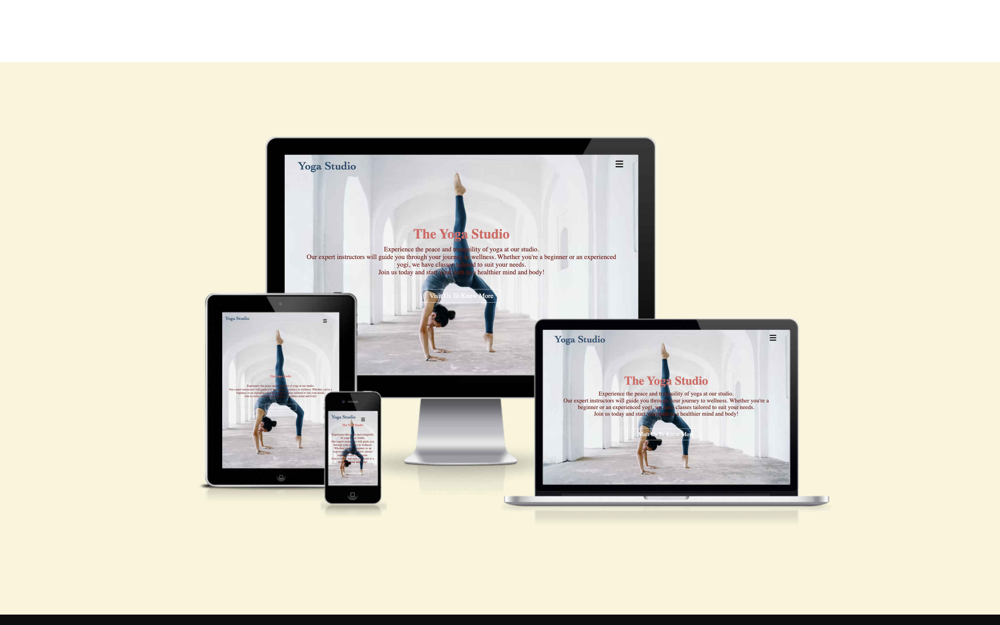
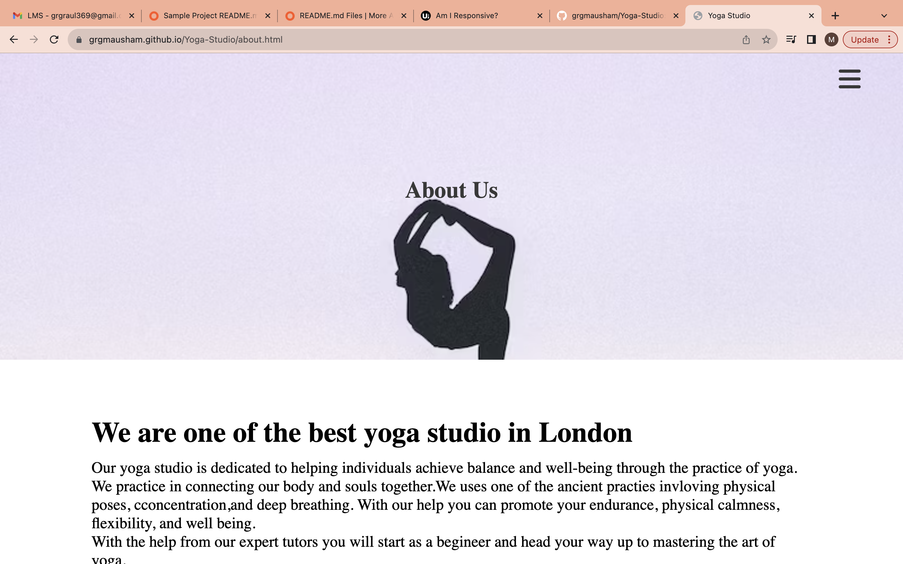
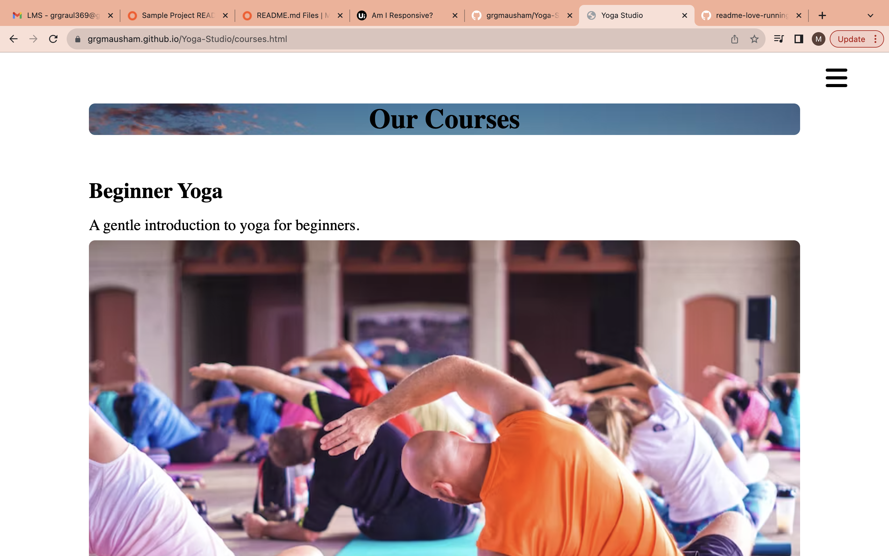
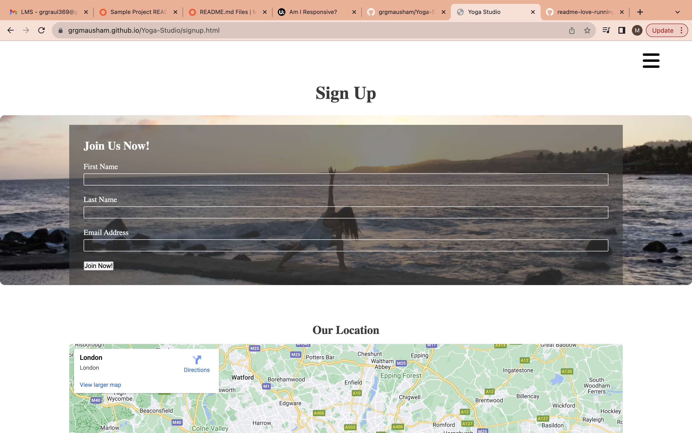
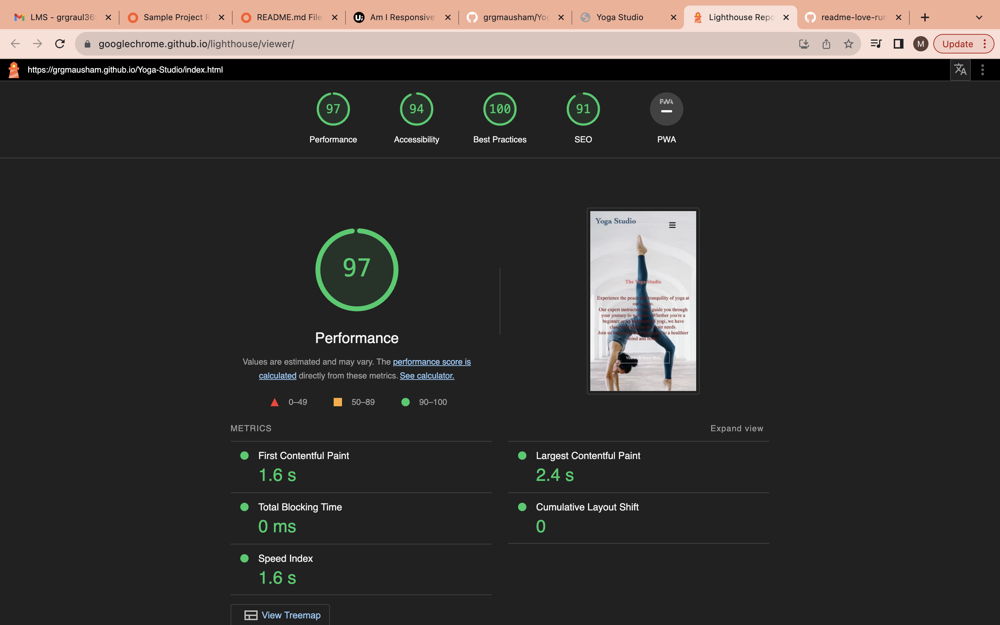

# Yoga Studio

Yoga Studio is a site that helps people experience the peace and tranquility of yoga.
The site will provide guidance for anyone who wants to join in the peacefull world of yoga whether you are beginner who just started to learn do yoga to a intermediate and pro. Yoga Studio will be perfect and useful for people who wants to practice yoga to maintain their physical and mental wellnss while learning it from experienced yogi.

## Features 
- Navigation Bar
  - Featured at tho top of the page, the navigation shows the studio name in the left cornor while all the other pages links are nested inside a clickable menu icon.
  -  The clickable menu bar have links to: Home, About Us, Courses and Signup section of this multiple pages website.
  - The menu bar have a icon which is clickable and when clicked it will display other pages link in a side bar with color contrast wih background.

## The Header

  - The Header shows the name of the club, using the calm blue color with matching font theme.
  - The header explain the club purpose and the paragraph is in the matching color or red with background.
  imgsrc:"assets/images/homepage.png";
  - Just below the paragraph section the home page contains a clickable link to next page to About Us. This clickable link have a very simple hover effect when hover overed the background color changes to red and the link text turn the color of white.
  -About Us

  - The About us page give attention about what the studio does and provides.
  - It aslo provide details to users about all the practices and benefits of the Yoga Studio
  - Inside About page contain another clickable link which say "explore now" which if clicked takes user to the Course page. This clickable link also have a similar hover effect as that of home page.

## Course

  - The course page gives all the details of kinds of courses available in Yoga Stuido.
  - It contains three different heading for three different courses, each containing brief summary of course.
  - As the other pages this page also contain the clickable link with hover effect with red color background when clicked takes user to the signup page.
  
## Signup

  - The signup page has a form to colllect the details of the intrested users so they can signup for Yoga Studio.
  - This form collects user first name, last name and email address.
  - This page also gives the user a current location of Yoga Studio to make it easier for the users to know the whereabouts of Yoga Studio.
  - This page also contain the contact section where the usres can find the contact details of Yoga Studio to get in touch or request their queries.
  

## Testing 

- I tested that this site works in different browsers : Chrome, Safari.
- I confirmed that this page is responsive, looks good and functions on all standard screen sizes using the devtools device toolbar.
- I confirmed that the navigation, header, home, about, course and signup text are all readable and easy to understand.
I have confirmed that the form wokrs : requires entirs in every field, will only take an email in the email field, and the submit button works. 
### Validator Testing 

- HTML
  - No errors were returned when passing through the official W3C validator
- CSS
  - No errors were found when passing through the official (Jigsaw) validator
- Accessibility
  - I confirmed that the color and fonts chosen are esay to read and accessible by runningit through lighthouse in devtools

- Unfixed Bugs
  - No unfixed bugs

## Deployment
- The site was deployed to GitHub pages. The steps to deploy are as follows: 
  - In the GitHub repository, navigate to the Settings tab 
  - From the source section drop-down menu, select the Master Branch
  - Once the master branch has been selected, the page will be automatically refreshed with a detailed ribbon display to indicate the successful deployment. 

The live link can be found here - [Yoga Studio](https://grgmausham.github.io/Yoga-Studio/)

## Credits 

### Content 
- The code to make social links was taken form [Love Running](https://grgmausham.github.io/Love-Running/)
- Instructions on how to implement  menu button and make it clickable on the  page was taken from [GreatStack](https://www.youtube.com/)
- The icons in the footer were taken from [Font Awesome](https://fontawesome.com/)

### Media

- The photos used on the home, about, course and signup page are from [Unsplash](https://unsplash.com/s/photos/url)
